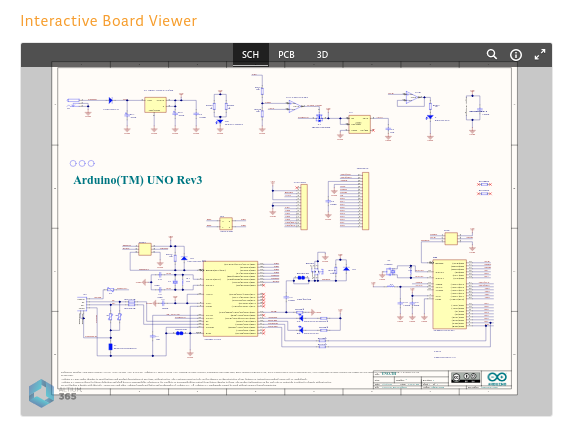
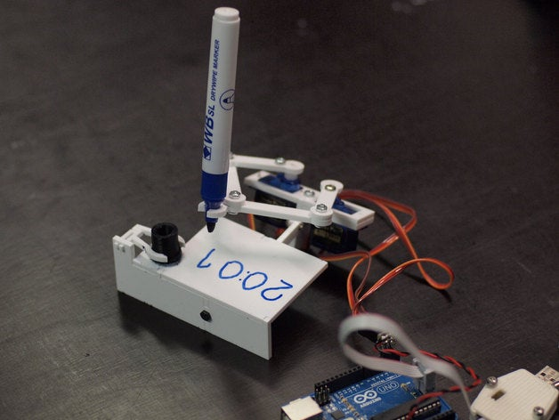
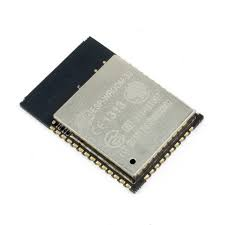
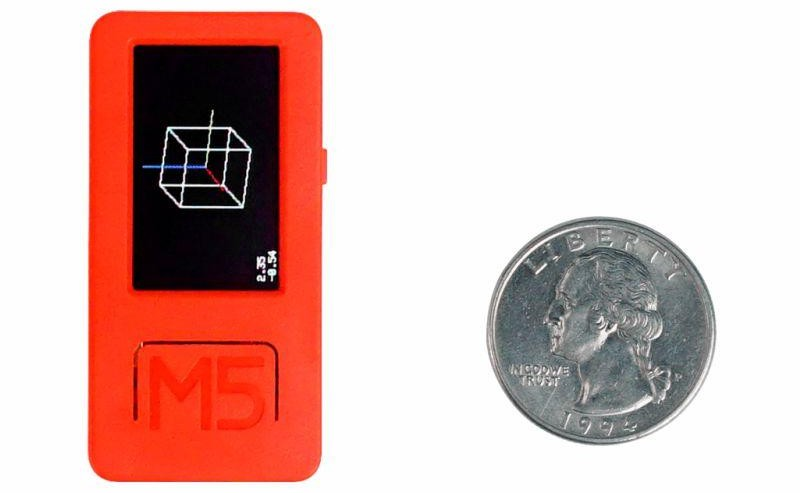
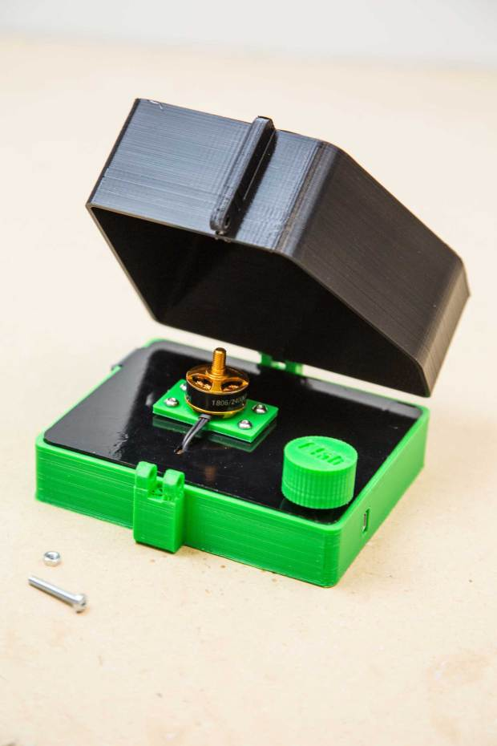
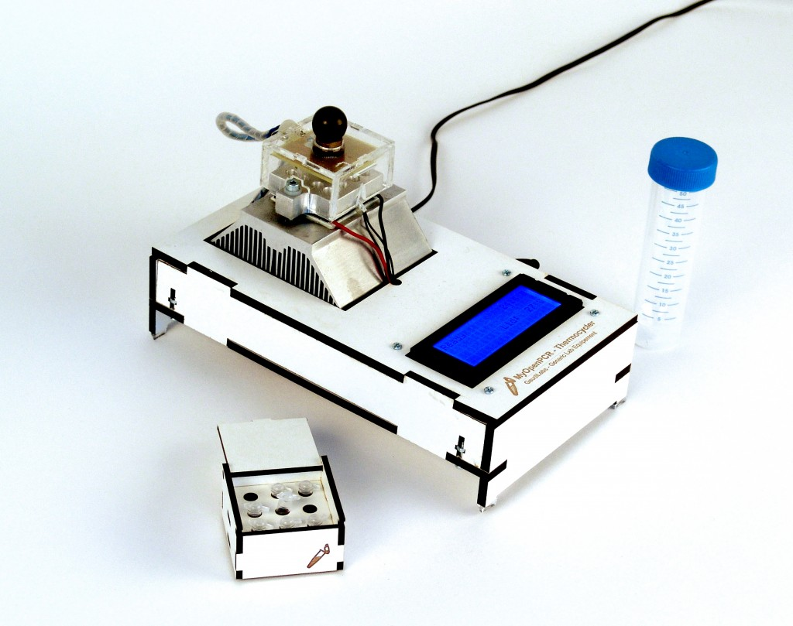
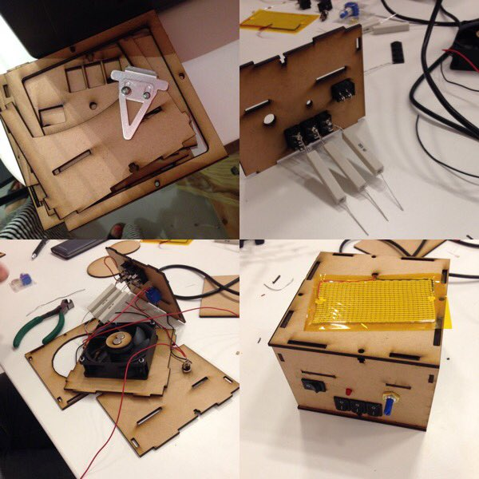

# Open Hardware

## Charla sobre Open Hardware para el curso de Software Libre de la UGR

## Licencia CC by SA 

## by José Antonio Vacas @javacasm

## Empecemos con un ejemplo...

Un ejemplo para entender qué es el Open Hardware:

* Alrededor de 2005 un grupo de ingenieros de diversos paises que trabajaban ayudando a artistas y diseñadores con la parte electrónica y programación, deciden crear un miniordenador (microcontrolador) sencillo de usar y programar, versátil y barato, con el que pudieran trabajar directamente gente sin una expecilización técnica.

Decidieron compartir todos los detalles para que cualquiera con unos mínimos conocimientos se pueda construir uno, compartiendo todos la información y el código de los programas para usarlo y programarlo.

Lo llamaron Arduino y es un excelente ejemplo de un proyecto Open Hardware y Open Source. De aquí nació una empresa también llamada Arduino.

Decimos que un proyecto es Open Hardware cuando tenemos toda la información necesaria para reproducirlo: todos los esquemas y detalles para construir sus electrónica o las piezas que lo componen

* Unos años después el usuario **Joo** (Johannes) publica todos los detalles de su [proyecto plotClock](http://wiki.fablab-nuernberg.de/w/Ding:Plotclock) dando detalles para construirlo, diseños 3D y código fuente para que cualquiera pueda reproducirlo con licencia CC, utilia la placa y el código de Arduino

    

* Por otro lado la empresa Expressif crea un dispositivo [ESP32](https://www.espressif.com/en/products/modules/esp32) haciéndolo compatible con el diseño de Arduino, con su software y libera toda la documentación, los detalles y los diseños necesarios para que cualquiera pueda usarlos. Es mucho más potente y avanzado que Arduino. Posteriormente la empresa Arduino incluye en algunas de sus placas las mejoras e incluso hay placas arduino que tiene un chip de Expressif 

    

* A partir de esos diseños otra empresa [M5Stack](https://m5stack.com/) crea el [m5Stick](https://m5stack.com/collections/m5-core/products/m5stickc-plus-esp32-pico-mini-iot-development-kit?variant=35275856609444) un sistema integrado compatible con Arduino y de un tamaño superreducido. Por supuesto todo el diseño está liberado como Open Hardware

    

* Luis Llamas, un conocido maker,  crea ESP32_faces, un software que permite mostrar "caritas" y "ojitos" en un M5Stack publicando con licencias libres todo sus detalles

    

* Nochi (@shikarunochi), un maker japonés, uniendo todos estos recursos ha montado esta monada de robot escribiente (aunque parece que tiene mejorar su letra...)

    

## Comunidades Open Hardware

El desarrollo del **Open Hardware** ha permitido la aparición de productos como **Arduino** o **micro:bit**  cuyo diseño y  documentación han sido publicadas completamente bajo licencias **Libres**

Todo este movimiento ha sido posible a la aparición de  enormes comunidades que han facilitado el aprendizaje y por tanto la creación de prototipos, donde se comparten toda la documentación de proyectos, como por ejemplo [Hackster.io](https://Hackster.io) que lleva **Alex Glow** (@glowascii)  con su inseparable mascota cibernética [Archimedes](https://www.hackster.io/glowascii/archimedes-the-ai-robot-owl-325ff5)

Otra importante comunidad online, la de [Hackaday](https://hackaday.com/), con cada vez más presencia femenina

Otra comunidad básica para el desarrollo del movimiento Open Hardware ha sido [Instructables](https://www.instructables.com/). 

Con solo entrar a su página vemos como el concepto de Open Hardware no solo se refiere a la parte de electrónica, también se pueden desarrollar cualquier tipo proyecto con esta licencia, como puede ser este [cortacesped](https://twitter.com/FreeCADNews/status/1327201595944296448) diseñado con la herramienta [Freecad](https://www.freecadweb.org/) también Open source

## Empresas con filosofía Open Hardware

También se ha creado una importante economía, con empresas que han nacido desde el convencimiento de compartir todos sus diseños como Open Hardware como **[Adafruit](https://www.adafruit.com/)** creada y dirigida por **Limor Fries** (@adafruit), gran maker, gran empresaria, "adalid" del movimiento OpenSource y de la inclusión de la mujer en el mundo maker y de la ingeniería

o [Sparkfun](https://www.sparkfun.com/) a partir de cuyos diseños se han creado muchas otras empresas especializadas en mejorar o abaratar sus diseños.

## Impresión 3D

A partir de estos desarrollos se han creado proyectos tan exitosos como **[RepRap](https://reprap.org/wiki/RepRap)**, abanderado por Adrian Bowyer que han hecho accesible al público herramientas como las **impresoras 3D**, permitiendo que cualquier persona con unos mínimos conocimientos técnica pueda montarlas y utilizarlas.

En España, este movimiento tuvo su difusión de la mano de los [tutoriales de Juan Gonzalez](http://www.iearobotics.com/wiki/index.php?title=Guia_de_montaje_de_la_Prusa_2) @obijuan 

El mundo de la  impresión 3D nos da un gran ejemplo de lo que podemos conseguir dentro del Open Hardware: diseño que podemos descargar y reproducir con nuestra impresora 3D

[Microscopio impreso](https://www.thingiverse.com/thing:77450) (sólo necesita las lentes y la iluminación)

Todo esto ha fomentado la difusión de las licencias libres haciendo conscientes a la gran mayoría de sus usuarios de las ventajas que aporta el trabajar en abierto y la publicación de manera libre y detallada nuestros proyectos

Con estos elementos al alcance de la mayoría se popularizado y simplificado tanto las herramientas de prototipado que practicamente cualquiera puede trabajar y crear todo tipo de proyectos.

En particular estas plataformas de prototipado rápido nos permiten crear equipamiento para laboratorio, máquinas que tienen el 90% de la funcionalidad de los equipos y con un coste de menos del 10%.

Además, **la naturaleza colaborativa y abierta de estos proyectos, nos amina a tomar un papel más activo en ellos**, permitiendonos a los usuarios de manera natural  participar en el desarrollo de estos equipos, mejorando iterativamente sus prestaciones, aportando mejoras a la funcionalidad, documentación o ejemplos de uso.

En definitiva, todo este ecosistema abierto de conocimientos nos hace día a día tener más control sobre la tecnología que usamos, **permitiendos pasar de meros consumidores a dueños de esta tecnología**

## Open Hardware en el laboratorio

Algunos ejmplos de estos proyectos pueden ser estos equipos de laboratorio bioquímito totalmente open-source 

* Una centrifugadora de materiales biológicos basada en Arduino
    

* O una termocicladora (para hacer PCRs) totalmente open 
    

* O una incubadora biológica

Con estos materiales podríamos hacer (salvo por el tema de la seguridad biológica de las muestras) los tests PCRs que se hace en los hospitales

Y estos equipos no son cosa de "frikis", la mismísima revista Nature se ha hecho eco en varios artículos sobre el tema: 
* [A DIY approach to automating your lab](https://www.nature.com/articles/d41586-019-01590-z)
* [How DIY technologies are democratizing science](https://www.nature.com/articles/d41586-020-03193-5)

## Recursos

[Curso de Software Libre](https://abierta.ugr.es/software_libre/)

[Vídeos](https://osl.ugr.es/videos/)

[Diseño arduino](https://store.arduino.cc/arduino-uno-rev3)

[Diseño micro:bit](https://tech.microbit.org/hardware/reference-design/)

[Cómo documentar proyectos Open Hardware](https://www.linkedin.com/pulse/c%25C3%25B3mo-documentar-proyectos-de-hardware-abierto-parte-cesar-garcia/)

## Makers ante la pandemia

Durante la pandemia y ante la petición de ayuda de los sanitarios, equipos de makers de toda España se autoorganizaron para aportar todo tipo de equipamiento de protección, consiguiendo generar miles de caretas, salvaorejas, adaptadores para equipos de respiración ... 

### Equipo de protección EPI

### Respirador

### Mascarilla libremask

