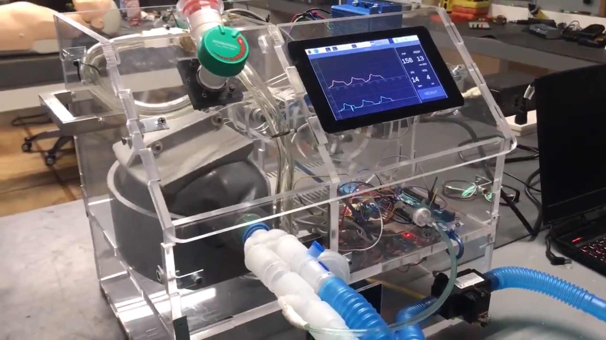

# Open Hardware

## Charla sobre Open Hardware para el curso de Software Libre de la UGR

## Licencia CC by SA 

## by José Antonio Vacas @javacasm

## Empecemos con un ejemplo...

Veamos un ejemplo para entender qué es el Open Hardware:

1) Alrededor de 2005 un grupo de ingenieros de diversos países que trabajaban ayudando a artistas y diseñadores con la parte electrónica y con la programación, deciden crear un miniordenador (un [*microcontrolador*](https://es.wikipedia.org/wiki/Microcontrolador) para ser más exactos) sencillo de usar y programar, versátil y barato, con el que pudieran trabajar directamente gente sin una especialización técnica.

Decidieron compartir todos los detalles necesarios para que cualquiera con unos mínimos conocimientos pudiera construir uno. Compartieron toda la información de su diseño electrónico y el código de los programas para usarlo y programarlo.

Lo llamaron [*Arduino*](https://es.wikipedia.org/wiki/Arduino) y es un excelente ejemplo de un proyecto Open Hardware y Open Source. De aquí nació una empresa también llamada Arduino, que vende millones de unidades de unos productos de los que da todos los detalles para que otros los fabriquen.

> *Detalles del diseño de una placa Arduino*
> Captura de la página de especificiones técnicas de Arduino
> Fichero https://content.arduino.cc/assets/UNO-TH_Rev3e_sch.pdf 
> Licencia CC By SA

Decimos que un proyecto es **Open Hardware** cuando tenemos toda la información necesaria para reproducirlo: todos los esquemas electrónicos, el diseño de sus piezas y los detalles para construirlo, su electrónica o las piezas que lo
componen.

2) Unos años después el usuario **Joo** (Johannes) publica todos los detalles de su [proyecto plotClock](http://wiki.fablab-nuernberg.de/w/Ding:Plotclock) dando detalles para construirlo, diseños 3D de sus piezas, montaje de la electrónica y el código fuente para que cualquiera pueda reproducirlo con licencia CC. En su proyecto utiliza la placa y el código de Arduino.

    
> *PlotClock by Joo*
> Imagen obtenida del modelo compartido de PlotClock compartido por Joo
> https://www.thingiverse.com/thing:248009
> Plotclock by joo is licensed under theCreative Commons - Attribution license.

3) Por otro lado, la empresa [*Expressif*](https://www.espressif.com/) crea un nuevo dispositivo, el [ESP32](https://www.espressif.com/en/products/modules/esp32) haciéndolo compatible con el diseño de Arduino, con su software y [*libera toda la documentación, los detalles y los diseños*](https://www.espressif.com/en/support/documents/technical-documents) necesarios para que cualquiera pueda usarlos crear placas más complejas o proyectos que lo utilicen. Es mucho más potente y avanzado que Arduino. 

> Módulo ESP32 de Expressif
> Imagen de la wikipedia
> https://commons.wikimedia.org/wiki/File:Espressif_ESP-WROOM-32_Wi-Fi_%26_Bluetooth_Module.jpg
> Licencia CC by SA 4.0

Posteriormente la empresa Arduino incluye en algunas de sus placas las mejoras e incluso hay placas Arduino que tiene un chip de Expressif. En este caso vemos como el compartir los avances libremente hace que el diseño se realimenta con las mejoras, permitiendo que el diseño original mejore. El Open Hardware es útil incluso para una empresa que vende sus productos.

4) A partir de esos diseños otra empresa [M5Stack](https://m5stack.com/) crea el [m5Stick](https://m5stack.com/collections/m5-core/products/m5stickc-plus-esp32-pico-mini-iot-development-kit?variant=35275856609444), un sistema integrado compatible con Arduino y con el ESP32 del que hablamos antes, pero de un tamaño superreducido y que además integra muchos componentes y mejores. Por supuesto todo su diseño está liberado como Open Hardware

5) [*Luis Llamas*](https://www.luisllamas.es/), un conocido maker, crea [*ESP32\_faces*](https://github.com/luisllamasbinaburo/ESP32_Faces/), un software que permite mostrar "caritas" y "ojitos" en un M5Stack publicando con licencia libre todos los detalles para reproducirlo. A día de hoy, ESP\_faces es uno de los ejemplos que la empresa m5Stack incluye en su documentación.

    
> *Caritas de Luis Llamas*
> Captura del tweet de Luis Llamas https://twitter.com/LuisLlamas/status/1303453666028990465
> ¿Licencia?

6) Nochi ([*@shikarunochi*](https://github.com/shikarunochi)), un maker japonés, uniendo todos estos recursos ha montado esta monada de robot escribiente (aunque parece que tiene mejorar su letra...), con el m5Stick, plotclock y “Caritas” de Luis Llamas y por supuesto ha compartido los [detalles de su proyecto](https://github.com/shikarunochi/Plotclock)

    
> *Caritas, haciendo gestos molones*
> Imagen https://pbs.twimg.com/media/EldBA0eU0AA_a4B?format=jpg&name=4096x4096
> Tweet de Nochi https://twitter.com/shikarunochi/status/
> ¿Licencia?

En este paseo por diferentes proyectos hemos visto cómo liberar los proyectos y compartir los detalles de su construcción nos permite crear cada vez proyectos más potentes y de un modo más sencillo.

También hemos visto cómo la filosofía Open Source es útil también para las empresas facilitando el desarrollo de nuevos productos, el trabajar en contacto con sus clientes, facilitandoles ejemplos para usar sus productos y al mismo tiempo usando los proyectos de éstos para mejorar su documentación. Más adelante veremos algunos ejemplos de estas empresas con una vocación 100% Open Source.

Tanto el desarrollo de estos proyectos, como su nacimiento (como en el caso de Arduino, donde sus creadores se conocieron a través de Internet) no hubiera sido posible sin la existencia de Comunidades Open Hardware, donde se han compartido ideas, dudas, proyectos,....

## ¿Qué entendemos por Open Hardware?

Vamos a ponernos un poco más técnicos y a ver los detalles de qué debe cumplir un proyecto para ser calificado como Open Hardware.

Realmente la denominación más correcta sería Open Source Hardware (OSHW son las siglas en inglés), es decir Hardware de tipo Open Source, aunque solemos abreviarlo como Open Hardware.

Existe una asociación internacional dedicada al cuidado de la licencia Open Hardware y de su estandarización: la [Open Source Hardware Association](https://www.oshwa.org/), abreviado la OSHWA.

Veamos la [definición que hace la OSHWA del  Open Source Hardware]((https://www.oshwa.org/definition/spanish/))

> "Hardware de Fuentes Abiertas (OSHW en inglés) es aquel hardware cuyo diseño se hace disponible públicamente para que cualquier persona lo pueda estudiar, modificar, distribuir, materializar y vender, tanto el original como otros objetos basados en ese diseño"

Obviamente las fuentes tienen que estar disponibles en formatos abiertos y libremente accesibles para que cualquiera puede realiza el derecho de modificicación.

Se recomienda usar componentes y materiales fácilmente disponibles e intentar que los procesos de producción necesarios sean lo más sencillos y libres posibles.

Todo proyecto Open Hardware debe incluir, también con licencia abierta, toda la documentación necesaria para que este sea reproducible y modificable.

Si como parte del proyecto se incluye algún software, éste debe ser licenciado como Open source o al menos que todos los interfaces del mismo estén perfectamente documentados como para que se pueda crear un software que sea Open Source.

La OSHWA también ha creado el [logo del Open Hardware](https://www.oshwa.org/open-source-hardware-logo/)

> Logo del Open Source Hardware
> Imagen de https://commons.wikimedia.org/wiki/File:Open-source-hardware-logo.svg
> Licencia  Creative Commons ShareAlike 1.0

### Certificación OSHW

La asociación también se encarga de certificar cuando un producto/proyecto cumple todo lo establecido y le podemos. Para ello [realiza un proceso](https://certification.oshwa.org/process.html) en el que comprueba que tango el hardware, el software, como la documentación y las posibles marcad del proyecto cumplen con todo lo establecido.

En [esta página](https://certification.oshwa.org/list.html) podemos ver un listado de los proyectos Open Hardware certificados. 

Entre ellos podemos encontrar la [placa Echidna Black](https://certification.oshwa.org/es000010.html) una placa derivada de Arduino que han creado unos [profesores españoles](http://echidna.es/) con los que he tenido la suerte de colaborar.

También podemos hacer una búsqueda por los proyectos liberados por empresas como Adafruit y nos encontraremos que son más de 400 los proyectos certificados como Open Hardware por esta empresa.

## Comunidades Open Hardware

El desarrollo del **Open Hardware** ha permitido la aparición de productos como [***Arduino***](https://www.arduino.cc/) o [***micro:bit***](https://microbit.org/) cuyo diseño y documentación han sido publicadas completamente bajo [***licencias Libres***](https://es.wikipedia.org/wiki/Contenido_libre), pero algunos de estos productos nacieron de la comunicación entre usuarios de comunidades online.

### Hackster.io

Todo este movimiento ha sido posible gracias a la aparición de enormes comunidades que han facilitado el aprendizaje y por tanto la creación de prototipos, donde se comparten toda la documentación de proyectos, como por ejemplo [Hackster.io](https://hackster.io) que lleva **Alex Glow** ([*@glowascii*](https://twitter.com/glowascii?lang=es)) con su
inseparable mascota cibernética *Archimedes*, que por supuesto puedes construir siguiendo los detalles [del proyecto](https://www.hackster.io/glowascii/archimedes-the-ai-robot-owl-325ff5).

> *Alex Glow y su mascota cibernética Archimedes*
> Imagen del [proyecto Archimedes: The AI Robot Owl](https://www.hackster.io/glowascii/archimedes-the-ai-robot-owl-325ff5)
> Licencia https://www.hackster.io/copyright-guidelines

En esta comunidad encontramos todo tipo de proyectos electrónicos, con enlaces a la documentación necesaria, listados de componentes y todo lo que necesitamos para reproducir un proyecto

### HackaDay

Otra importante comunidad online, y bastante antigua es [*HackaDay*](https://hackaday.io/), con cada vez más presencia femenina, como podemos ver en la portada.

Originariamente, como su nombre indica, publicaban un “hack” cada día, un proyecto molón o algo interesante. Actualmente además de proporcionar espacio para que se publiquen proyectos, organizan [*concursos*](https://prize.supplyframe.com/), cursos, tienen un [*mercado*](https://www.tindie.com) para que los participantes vendamos nuestros productos ...

> * Captura de la portada de la página Hackaday.io*
> ¿Licencia https://hackaday.io/tos ?

**TODO Red de hackerspaces https://hackaday.io/hackerspaces**

### Instructables

Otra comunidad básica para el desarrollo del movimiento Open Hardware ha sido [Instructables](https://www.instructables.com/), originariamente independiente, aunque a día de hoy es propiedad del gigante del software Cad Autodesk.

> *Listado de proyectos en la portada de Instructables.com*
> Captura de la portada de instructables.com
> ¿Licencia https://www.instructables.com/community/Overview-of-License-on-Publish-page/ ?

Con solo entrar a su página vemos cómo el concepto de Open Hardware no solo se refiere a proyectos electrónicos, también se pueden desarrollar cualquier proyecto con esta licencia, tanto de diseño 3D, como de [*modificaciones* *para nuestro Toyota Prius*](https://www.instructables.com/How-to-Jump-Start-a-Toyota-Prius/)

Existen muchos proyectos de sistemas de riego, como [*éste*](https://www.instructables.com/Automatic-Irrigation-System-Arduino-With-Usb-Type-/), o control de toldos con seguridad NFC como [*este otro*](https://www.instructables.com/Smart-Balcony-Shade-Using-NFC/) o casi cualquier cosa que se nos ocurra, como puede ser este [cortacesped](https://twitter.com/FreeCADNews/status/1327201595944296448) diseñado con la herramienta [*Freecad*](https://www.freecadweb.org/) también Open source

> *Diseño opensource de cortacesped*
> Imagen de foro de Freecad https://forum.freecadweb.org/viewtopic.php?f=24&t=48473&p=447135#p447135 de master user master #ppemawm 
> o de tweet https://twitter.com/FreeCADNews/status/1327201595944296448 

### Makezine

TODO

## Empresas con filosofía Open Hardware

El Open Hardware también ha permitido la creación de empresas exitosas, con empresas que han nacido desde el convencimiento de compartir todos sus diseños con licencias Open Hardware como [**Adafruit**](https://www.adafruit.com/) creada y dirigida por [***Limor Fried***](https://es.wikipedia.org/wiki/Limor_Fried), gran maker, gran empresaria, impulsora desde ejemplo del movimiento Open Source y de la inclusión de la mujer en el mundo maker y de la ingeniería. 

> Limor Fried
> Imagen de la wikipedia https://en.wikipedia.org/wiki/Limor_Fried
> Licencia CC BY SA 2.0

Otra empresa con vocación Open Source, es también [Sparkfun](https://www.sparkfun.com/) a partir de cuyos diseños se han creado muchas otras empresas especializadas en mejorar o abaratar sus diseños.

No podemos olvidarnos por supuesto de [*Arduino*](https://www.arduino.cc/) que a día de hoy es una gran empresa y a la que tenemos que culpar del éxito del movimiento Maker.

## Licencias Open Hardware para empresas

Por aclarar conceptos ¿puede una empresa vender un producto que otra empresa licencia como Open Hardware? Todo esto va a depender de la licencia que use la empresa creadora.

Veamos 2 ejemplos:

* Adafruit vende una placa llamada [*Feather*](https://www.adafruit.com/product/2830), de la que > comparte el [*diseño*](https://learn.adafruit.com/assets/28509) con licencia [*CC BY-SA 3.0*](https://creativecommons.org/licenses/by-sa/3.0/es/) (pide > atribución y que se respete la licencia y se compartan las  modificaciones). Si quisiera compartirlo pero que nadie pudiera venderlo podría usar la licencia [*CC BY-NC 4.0*](https://creativecommons.org/licenses/by-nc/4.0/) que lo prohíbe específicamente.

* Arduino en la [*documentación de sus placas*](https://content.arduino.cc/assets/UNO-TH_Rev3e_sch.pdf) también usa la misma licencia, lo que ha permitido que muchas otras empresas fabriquen placas clónicas de las suyas. Pero incluye cláramente que no pueden llamarlas “Arduino”, puesto que esto es una marca comercial, por eso proliferan las placas llamadas ...duino (añada el prefijo que más les guste)

## Impresión 3D

A partir de estos desarrollos abiertos se han creado proyectos tan exitosos como [**RepRap**](https://reprap.org/wiki/RepRap), abanderado por [*Adrian Bowyer*](https://es.wikipedia.org/wiki/Adrian_Bowyer), originariamente destinado a crear prototipos en los laboratorios de un modo más rápido y eficiente y que ha hecho accesible a todo el público las **impresoras 3D**, permitiendo que cualquier persona con unos mínimos conocimientos técnicos pueda montarlas y utilizarlas.

> *Primera replicación de una impresora 3D.*
> Imagen de la wikipedia https://es.wikipedia.org/wiki/Archivo:First_replication.jpg
> Licencia CC BY SA 3.0

Adrian Bowyer creó una impresora que era capaz de imprimir ciertas piezas (de plástico) que no podía comprar, y que permitieron mejorar su diseño. Imprimió unas piezas nuevas que regaló a su compañero de laboratorio junto con todos los detalles para reproducir su impresora y este puedo hacer una nueva impresora (la que aparece como “Child” en la foto)

De hecho, compartió sus diseños en internet permitiéndonos a todos acceder a esa tecnología.

En la imagen se ve una impresión 3D hecha por mismísimo Alberto Chicotw (sí, el cocinero) a partir de un diseño compartido en internet

> Imagen un busto de Nefertity impreso
> Modelo: https://www.myminifactory.com/object/3d-print-bust-of-nefertiti-at-the-egyptian-museum-berlin-2951
> Tweet de Alberto Chicote https://twitter.com/albertochicote/status/1352592690739892225
> ¿Licencia?

A día de hoy existen empresas que venden cientos de miles de impresoras 3D al año, compartiendo todo el diseño como [*Prusa Research*](https://www.prusa3d.es/) del carismático [*Joseph Prusa*](https://www.prusa3d.es/sobre-nosotros/#timeline)

En España, este movimiento tuvo su difusión de la mano de los [tutoriales de Juan González](http://www.iearobotics.com/wiki/index.php?title=Guia_de_montaje_de_la_Prusa_2) [*@obijuan*](http://www.iearobotics.com/wiki/index.php?title=Obijuan_Academy) que nos permitieron aprender sobre el uso de las impresoras y el software libre de diseño 3D como [*FreeCad*](https://www.freecadweb.org/). 

El mundo de la impresión 3D nos da un gran ejemplo de lo que podemos conseguir dentro del Open Hardware: diseños y proyectos que podemos descargar y reproducir con nuestra impresora 3D, como por ejemplo este [Microscopio impreso](https://www.thingiverse.com/thing:77450) (sólo necesita las lentes y la iluminación)

> Microscopio impreso
> Imagen del modelo https://www.thingiverse.com/thing:77450
> Licencia: Attribution-NonCommercial 4.0 International (CC BY-NC 4.0)

En los diferentes repositorios de modelos 3D, como [*Thingiverse*](https://www.thingiverse.com/) o [*Cult3d*](https://cults3d.com/es) o [*Minifactory*](https://www.myminifactory.com/es/) nos vamos a encontrar diseños de todo tipo, con diferentes licencias, unos serán gratuitos y otros de pago.

## Open FPGAs

Vamos a ver otro ejemplo de cómo el movimiento Open Hardware puede revolucionar un sector. 

Desde hace muchos años (a mediados de los 80s) existen unos chips llamados [***FPGAs***](https://es.wikipedia.org/wiki/Field-programmable_gate_array), que nos permiten crear en su interior una gran variedad de circuitos. 

Podemos pensar que una FPGA es como un circuito en blanco, repleto de piezas desconectadas y que mediante cierto proceso, parecido a la programación, podemos convertir en un circuito concreto. Si detectamos un error podemos volver a repetir el proceso arreglando el error.

El proceso para “programar” las FPGAs era algo cerrado por los fabricantes, que obligaban a sus usuarios a comprar un software capaz de hacer ese proceso. Debido a esto su uso estaba restringido a grandes proyectos con abultados presupuestos.

En mayo de 2015, Claire Wolf y Mathias Lasser con su proyecto [*iceStorm*](http://www.clifford.at/icestorm/) crearon un conjunto de herramientas Open Source que permitían usar de una manera libre algunos modelos de FPGAs, permitiendo que cualquiera pueda usar ahora estas herramientas. Podéis leer más detalles de esta historia [*en la charla*](https://github.com/Obijuan/myslides/wiki/2016_09_23-Granada-Geek-FPGAs-Libres) de [*Juan González @Obijuan*](https://twitter.com/obijuan_cube?lang=es) que tuvimos el honor de recibir en la OSL en mayo de 2016.

A raíz de este desarrollo se han creado placas Open Hardware que usan FPGAs como la [*IceZum Alhambra*](https://github.com/fpgawars/icezum/wiki) o la [*Alhambra II*](https://github.com/FPGAwars/Alhambra-II-FPGA/wiki) creadas por @obijuan y por el granadino [*Eladio Delgado*](https://twitter.com/eladiodm?lang=es)

Este proyecto también ha permitido la creación de entornos sencillos de usar como [*iceStudio*](https://icestudio.io/) y que nos permiten a todos usar esta tecnología que antes sólo estaba en manos de unos pocos.

Finalmente, las mismas empresas que antes obligaban a comprar su software, ahora colaboran en las herramientas libres.

## Open Hardware en el laboratorio

TODO: red de  laboratorios open  https://www.hackteria.org/

Veamos algunos ejemplos de estos proyectos como pueden ser estos equipos de laboratorio bioquímico totalmente open-source. Podemos conseguir tanto el diseño de las piezas para imprimir la carcasa, como el diseño de la electrónica o los programas que las controlan.

> 

- Una centrifugadora de materiales biológicos basada en Arduino

    
> Centrifugadora hecha a partir de un disco duro
> Imagen de http://hackteria.org/wiki/Hacked_Hard-disc_Centrifuge
> Licencia: Creative Commons Attribution 3.0  

* O una termocicladora (para hacer PCRs) totalmente open 

> Open Termocicladora o PCR
> Imagen de http://hackteria.org/wiki/Wild_OpenPCR
> Licencia: Creative Commons Attribution 3.0 

* O una incubadora biológica

> Incubadora DIY
> Imagen de http://hackteria.org/wiki/DIY_Incubator
> Licencia: Creative Commons Attribution 3.0 

> *Material de Open Labs*
> Imagen de http://hackteria.org/wiki/Generic_Lab_Equipment#Lab_tools
> Licencia: Creative Commons Attribution 3.0 

Con estos materiales podríamos hacer (salvo por el tema de la seguridad biológica de las muestras) los tests PCRs que se hace en los hospitales

Y estos equipos no son cosa de "frikis", la mismísima revista Nature se ha hecho eco en varios artículos sobre el tema:

* [A DIY approach to automating your lab](https://www.nature.com/articles/d41586-019-01590-z)
* [How DIY technologies are democratizing science](https://www.nature.com/articles/d41586-020-03193-5)

Además el que dispongamos de toda la información sobre un producto le asegura una vida útil más larga, facilita la posibilidad de reparaciones y nos evita la dependencia con la empresa que nos lo vendió.

## Makers ante la pandemia

Durante la pandemia y ante la petición de ayuda de los sanitarios, equipos de makers de toda España se autoorganizaron para aportar todo tipo de equipamiento de protección, consiguiendo generar miles de caretas, salvaorejas, adaptadores para equipos de respiración ... 

> Equipo de protección EPI
> Foto propia
> Licencia CC by SA

> Respirador Open Hardware Reespirator (Licencia  GNU General Public License v3.0.)
> Captura del tweet https://twitter.com/AgsReesistencia/status/1271109418554241024
> ¿Licencia del tweet?

> *Ejemplo de la documentación del respirador*
> Imagen de la documentación del respirador https://gitlab.com/reesistencia
> Licencia  GNU General Public License v3.0.  

## Resumen

Todo esto ha fomentado la difusión de las licencias libres haciendo conscientes a la población de las ventajas que aporta el trabajar en abierto y la publicación de manera libre y detallada de nuestros proyectos

Estas herramientas que están al alcance de la mayoría de la población, cada vez más sencillas de usar y fáciles de encontrar, ha permitido que casi cualquiera pueda crear todo tipo de proyectos, más o menos complejos.

Por ejemplo estas herramientas de prototipado rápido nos permiten crear equipamiento para laboratorio, máquinas que tienen el 90% de la funcionalidad de los equipos y con un coste de menos del 10%.

Además, **la naturaleza colaborativa y abierta de estos proyectos, nos anima a tomar un papel más activo en ellos**, permitiéndonos a los usuarios de manera natural participar en el desarrollo de estos equipos, mejorando iterativamente sus prestaciones, aportando mejoras a la funcionalidad, documentación o ejemplos de uso.

En definitiva, todo este ecosistema abierto de conocimientos nos hace día a día tener más control sobre la tecnología que usamos, **permitiéndonos pasar de meros consumidores a dueños de esta tecnología**

Además al ser dueños de toda esta información podemos modificar nuestros proyectos, repararlos, mejorar sus prestaciones, traducir la información a otros idiomas,... en definitiva, tenemos control total sobre ellos.

## Recursos

[Curso de Software Libre](https://abierta.ugr.es/software_libre/)

[Vídeos](https://osl.ugr.es/videos/)

[Diseño arduino](https://store.arduino.cc/arduino-uno-rev3)

[Diseño micro:bit](https://tech.microbit.org/hardware/reference-design/)

[Cómo documentar proyectos Open Hardware](https://www.linkedin.com/pulse/c%25C3%25B3mo-documentar-proyectos-de-hardware-abierto-parte-cesar-garcia/)

