# Open Hardware

## Módulo sobre Open Hardware para el MOOC  de Software Libre de la UGR

## Licencia CC by SA 

## by José Antonio Vacas @javacasm

## Empecemos con un ejemplo...

Veamos un ejemplo para entender qué es el Open Hardware:

1) Alrededor de 2005 un grupo de ingenieros de diversos países que trabajaban ayudando a artistas y diseñadores con la parte electrónica y con la programación, deciden crear un miniordenador (un [*microcontrolador*](https://es.wikipedia.org/wiki/Microcontrolador) para ser más exactos) sencillo de usar y programar, versátil y barato, con el que pudieran trabajar directamente gente sin una especialización técnica.

Decidieron compartir todos los detalles necesarios para que cualquiera con unos mínimos conocimientos pudiera construir uno. Compartieron toda la información de su diseño electrónico y el código de los programas para usarlo y programarlo.

Lo llamaron [*Arduino*](https://es.wikipedia.org/wiki/Arduino) y es un excelente ejemplo de un proyecto Open Hardware y Open Source. De aquí nació una empresa también llamada Arduino, que vende millones de unidades de unos productos de los que da todos los detalles para que otros los fabriquen.

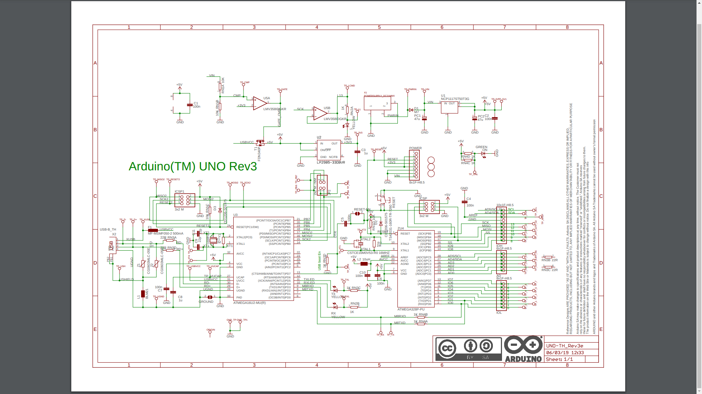
> *Detalles del diseño de una placa Arduino*
> Captura de la página de especificiones técnicas de Arduino
> [Diseño de Arduino](https://content.arduino.cc/assets/UNO-TH_Rev3e_sch.pdf) 
> Licencia CC By SA

Decimos que un proyecto es **Open Hardware** cuando tenemos toda la información necesaria para reproducirlo: todos los esquemas electrónicos, el diseño de sus piezas y los detalles para construirlo, su electrónica o las piezas que lo
componen.

2) Unos años después el usuario **Joo** (Johannes) publica todos los detalles de su [proyecto plotClock](http://wiki.fablab-nuernberg.de/w/Ding:Plotclock) dando detalles para construirlo, diseños 3D de sus piezas, montaje de la electrónica y el código fuente para que cualquiera pueda reproducirlo con licencia CC. En su proyecto utiliza la placa y el código de Arduino.

    
> *PlotClock by Joo*
> Imagen obtenida del [modelo compartido de PlotClock compartido por Joo](https://www.thingiverse.com/thing:248009)
> Plotclock by joo is licensed under the Creative Commons - Attribution license.

3) Por otro lado, la empresa [*Expressif*](https://www.espressif.com/) crea un nuevo dispositivo, el [ESP32](https://www.espressif.com/en/products/modules/esp32) haciéndolo compatible con el diseño de Arduino, con su software y [*libera toda la documentación, los detalles y los diseños*](https://www.espressif.com/en/support/documents/technical-documents) necesarios para que cualquiera pueda usarlos para crear placas más complejas o proyectos que lo utilicen. Es mucho más potente y avanzado que Arduino. 

> Módulo ESP32 de Expressif
> [Imagen de la wikipedia](https://commons.wikimedia.org/wiki/File:Espressif_ESP-WROOM-32_Wi-Fi_%26_Bluetooth_Module.jpg)
> Licencia CC by SA 4.0

Posteriormente la empresa Arduino incluye en algunas de sus placas las mejoras e incluso hay placas Arduino que tiene un chip de Expressif. En este caso vemos como el compartir los avances libremente hace que el diseño se realimenta con las mejoras, permitiendo que el diseño original mejore. El Open Hardware es útil incluso para una empresa que vende sus productos.

4) A partir de esos diseños otra empresa [M5Stack](https://m5stack.com/) crea el [m5Stick](https://m5stack.com/collections/m5-core/products/m5stickc-plus-esp32-pico-mini-iot-development-kit?variant=35275856609444), un sistema integrado compatible con Arduino y con el ESP32 del que hablamos antes, pero de un tamaño superreducido y que además integra muchos componentes y mejores. Por supuesto todo su diseño está liberado como Open Hardware

5) [*Luis Llamas*](https://www.luisllamas.es/), un conocido maker, crea [*ESP32\_faces*](https://github.com/luisllamasbinaburo/ESP32_Faces/), un software que permite mostrar "caritas" y "ojitos" en un M5Stack publicando con licencia libre todos los detalles para reproducirlo. A día de hoy, ESP\_faces es uno de los ejemplos que la empresa m5Stack incluye en su documentación.

    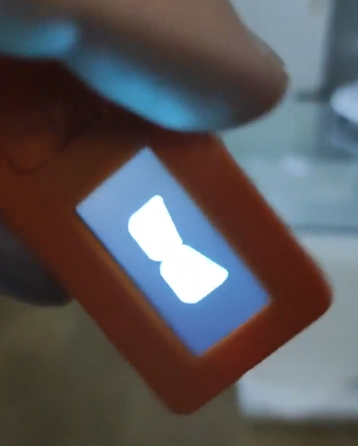
> *Caritas de Luis Llamas*
> Captura del [tweet de Luis Llamas](https://twitter.com/LuisLlamas/status/1303453666028990465) reproducido con su permiso.

6) Nochi ([*@shikarunochi*](https://github.com/shikarunochi)), un maker japonés, uniendo todos estos recursos ha montado esta monada de robot escribiente (aunque parece que tiene mejorar su letra...), con el m5Stick, plotclock y “Caritas” de Luis Llamas y por supuesto ha compartido los [detalles de su proyecto](https://github.com/shikarunochi/Plotclock)

    
> *Caritas, haciendo gestos molones*
> [Imagen del Tweet de Nochi](https://pbs.twimg.com/media/EldBA0eU0AA_a4B?format=jpg&name=4096x4096) reproducido con su permiso.

En este paseo por diferentes proyectos hemos visto cómo liberar los proyectos y compartir los detalles de su construcción nos permite crear cada vez proyectos más potentes y de un modo más sencillo.

También hemos visto cómo la filosofía Open Source es útil también para las empresas facilitando el desarrollo de nuevos productos, el trabajar en contacto con sus clientes, facilitandoles ejemplos para usar sus productos y al mismo tiempo usando los proyectos de éstos para mejorar su documentación. Más adelante veremos algunos ejemplos de estas empresas con una vocación 100% Open Source.

Tanto el desarrollo de estos proyectos, como su nacimiento (como en el caso de Arduino, donde sus creadores se conocieron a través de Internet) no hubiera sido posible sin la existencia de Comunidades Open Hardware, donde se han compartido ideas, dudas, proyectos,....

## ¿Qué entendemos por Open Hardware?

Vamos a ponernos un poco más técnicos y a ver los detalles de qué debe cumplir un proyecto para ser calificado como Open Hardware.

Realmente la denominación más correcta sería Open Source Hardware (OSHW son las siglas en inglés), es decir Hardware de tipo Open Source, aunque solemos abreviarlo como Open Hardware.

Existe una asociación internacional dedicada al cuidado de la licencia Open Hardware y de su estandarización: la [Open Source Hardware Association](https://www.oshwa.org/), abreviado la OSHWA.

Veamos la [definición que hace la OSHWA del  Open Source Hardware]((https://www.oshwa.org/definition/spanish/))

> "Hardware de Fuentes Abiertas (OSHW en inglés) es aquel hardware cuyo diseño se hace disponible públicamente para que cualquier persona lo pueda estudiar, modificar, distribuir, materializar y vender, tanto el original como otros objetos basados en ese diseño"

Obviamente las fuentes tienen que estar disponibles en formatos abiertos y libremente accesibles para que cualquiera puede realizar el derecho de modificación.

Se recomienda usar componentes y materiales fácilmente disponibles e intentar que los procesos de producción necesarios sean lo más sencillos y libres posibles.

Todo proyecto Open Hardware debe incluir, también con licencia abierta, toda la documentación necesaria para que este sea reproducible y modificable.

Si como parte del proyecto se incluye algún software, éste debe ser licenciado como Open source o al menos que todos los interfaces del mismo estén perfectamente documentados como para que se pueda crear un software que sea Open Source.

La OSHWA también ha creado el [logo del Open Hardware](https://www.oshwa.org/open-source-hardware-logo/)

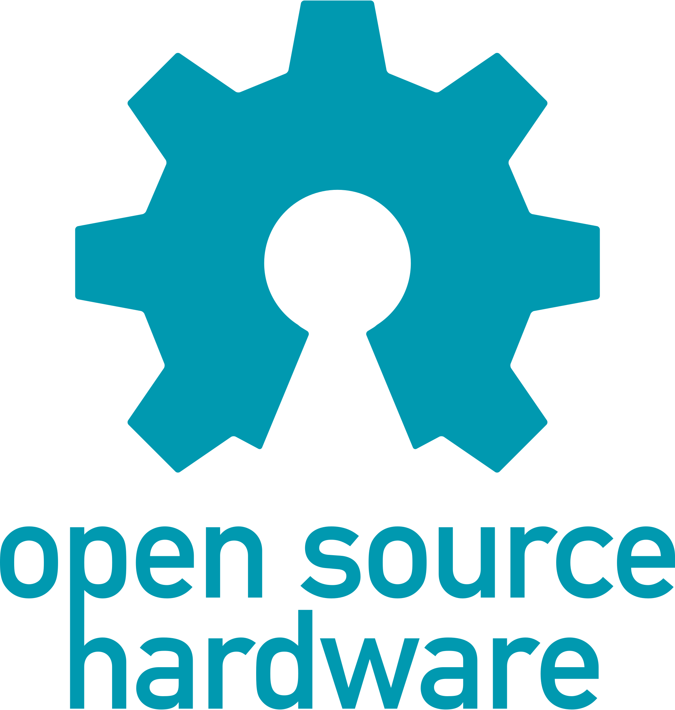
> Logo del Open Source Hardware
> [Imagen de wikimedia](https://commons.wikimedia.org/wiki/File:Open-source-hardware-logo.svg)
> Licencia  Creative Commons ShareAlike 1.0

### Certificación OSHW

La asociación también se encarga de certificar cuando un producto/proyecto cumple todo lo establecido y lo podemos. Para ello [realiza un proceso](https://certification.oshwa.org/process.html) en el que comprueba que tanto el hardware, el software, como la documentación y las posibles marcad del proyecto cumplen con todo lo establecido.

En [esta página](https://certification.oshwa.org/list.html) podemos ver un listado de los proyectos Open Hardware certificados. 

Entre ellos podemos encontrar la [placa Echidna Black](https://certification.oshwa.org/es000010.html) una placa derivada de Arduino que han creado unos [profesores españoles](http://echidna.es/) con los que he tenido la suerte de colaborar.

También podemos hacer una búsqueda por los proyectos liberados por empresas como Adafruit y nos encontraremos que son más de 400 los proyectos certificados como Open Hardware por esta empresa.

## Open Hardware Repository del CERN

Open Hardware Repository (OHWR) es una plataforma fundada por ingenieros del CERN (Organización Europea para la Investigación Nuclear, uno de los mayores laboratorios de física de partículas del mundo) y que proporciona alojamiento a muchos proyectos Open Hardware. 

Algunos de estos proyectos han sido creados en el CERN y otros no. Podemos ver un listado de ellos en [esta página](https://ohwr.org/explore)

El CERN no sólo colabora alojando los proyectos, también al publicar los proyectos propios permite a investigadores de todo el mundo usar estas tecnologías.

También apoya la difusión de los proyectos Open Hardware colaborando en la creación y financiación de [Kicad](http://www.kicad-pcb.org/), herramienta Open Source para el diseño de equipos electrónicos

## Caso de éxito del Open Hardware: Micropython

Vamos a ver un caso de éxito de Open Source Hardware: [micropython](https://micropython.org/)

> Logo de micripython
> Imagen de https://es.wikipedia.org/wiki/MicroPython#/media/Archivo:Micropython-logo.svg
> Licencia MIT

Micropython es una implementación del conocido lenguaje Python optimizada para que se ejecute en microcontroladores. 

Nació en 2013, cuando el físico y programador australiano [Damien George](https://dpgeorge.net/) creó una exitosa [campaña de crowdfunding en Kickstarter](https://www.kickstarter.com/projects/214379695/micro-python-python-for-microcontrollers?lang=es) (tenía un objetivo de 15000£ y consiguió casi 100000£) para financiar el desarrollo tanto del lenguaje como de una placa donde se pudiera ejecutar, a la que sin mucha imaginación llamó la pyBoard.

Podemos encontrar toda la documentación del proyecto en [su página](https://micropython.org/) y por supuesto en la [página del proyecto en github](https://github.com/micropython/micropython)

Una prueba del éxito del proyecto Micropython, es que en su página de github se han creado miles de versiones (se han hecho más de 4000 forks), de las empresas han derivado la versión para su propias placas. También se puede ver en el repositorio que son más 300 los desarrolladores que han contribuido al mismo y si miramos las actualizaciones podemos ver que hay cambios cada día.

A día de hoy son muchísimas las plataformas, además de la original [pyboard](http://micropython.org/download/pybv1), que permiten usar Micropython como lenguaje de programación como por ejemplo las [ESP](http://micropython.org/download/esp8266) y [ESP32](http://micropython.org/download/esp32) de Expressif, las de [m5Stack](https://github.com/m5stack/M5Stack_MicroPython), en las [STM32](http://micropython.org/download/stm32), en la famosísima [micro:bit](https://microbit.org/get-started/user-guide/python/) e incluso en la [Raspberry Pi](https://github.com/boochow/micropython-raspberrypi). De hecho uno de los entornos de programación [recomendados para la nueva Raspberry Pi Pico es micropython](http://micropython.org/download/rp2-pico).

Otras marcas, como Adafruit, han optado por crear una versión derivada, pero algo distinta, más optimizada para sus placas llamada [circuitpython](https://learn.adafruit.com/bienvenido-a-circuitpython-2/que-es-circuitpython) y que puede funcionar en dispositivos aún más pequeños y limitados.

Si queremos probar a usar micropython podemos usar el [simulador online Unicorn](http://micropython.org/unicorn/)  que incluye algunos ejemplos ya preparados.

Podemos ver más detalles en la página de la [wikipedia de micropython](https://es.wikipedia.org/wiki/MicroPython).

Micropython es un ejemplo de cómo un proyecto completamente abierto puede crecer hasta convertirse en un estándar de hecho, generar otros proyectos, ofrecer alternativas a empresas que pueden desarrollar y vender sus productos al mismo tiempo que comparten sus mejoras y aprovechan las que los usuarios pueden incorporar día a día.

## Comunidades Open Hardware

El desarrollo del **Open Hardware** ha permitido la aparición de productos como [***Arduino***](https://www.arduino.cc/) o [***micro:bit***](https://microbit.org/) cuyo diseño y documentación han sido publicadas completamente bajo [***licencias Libres***](https://es.wikipedia.org/wiki/Contenido_libre), pero algunos de estos productos nacieron de la comunicación entre usuarios de comunidades online.

### Hackster.io

Todo este movimiento ha sido posible gracias a la aparición de enormes comunidades que han facilitado el aprendizaje y por tanto la creación de prototipos, donde se comparten toda la documentación de proyectos, como por ejemplo [Hackster.io](https://hackster.io) que lleva **Alex Glow** ([*@glowascii*](https://twitter.com/glowascii?lang=es)) con su inseparable mascota cibernética *Archimedes*, que por supuesto puedes construir siguiendo los detalles [del proyecto](https://www.hackster.io/glowascii/archimedes-the-ai-robot-owl-325ff5).

> *Alex Glow y su mascota cibernética Archimedes*
> Imagen del [proyecto Archimedes: The AI Robot Owl](https://www.hackster.io/glowascii/archimedes-the-ai-robot-owl-325ff5)
> [Licencia](https://www.hackster.io/copyright-guidelines)

En esta comunidad encontramos todo tipo de proyectos electrónicos, con enlaces a la documentación necesaria, listados de componentes y todo lo que necesitamos para reproducir un proyecto

### Hack-a-Day

Otra importante comunidad online, y bastante antigua es [*HackaDay*](https://hackaday.io/), con cada vez más presencia femenina, como podemos ver en la portada.

Originariamente, como su nombre indica, publicaban un “hack” cada día, un proyecto molón o algo interesante. Actualmente además de proporcionar espacio para que se publiquen proyectos, organizan [*concursos*](https://prize.supplyframe.com/), cursos, tienen un [*mercado*](https://www.tindie.com) para que los participantes vendamos nuestros productos ...

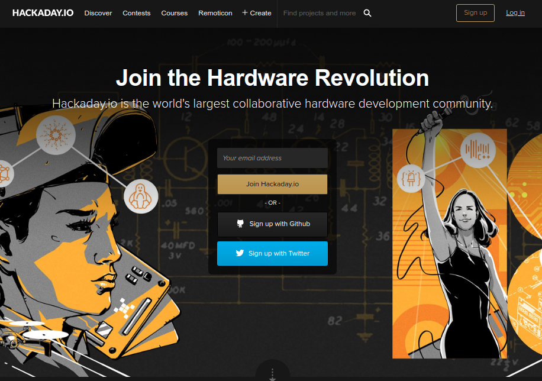
> *Captura de la portada de la página Hackaday.io*
> [Licencia](https://hackaday.io/tos ?)

La red online HackADay ha contribuido también a la creación de un [red de más de 750 HackerSpaces en todo el mundo](https://hackaday.io/hackerspaces) como podemos ver en el mapa.

### Instructables

Otra comunidad básica para el desarrollo del movimiento Open Hardware ha sido [Instructables](https://www.instructables.com/), originariamente independiente, aunque a día de hoy es propiedad del gigante del software Cad Autodesk.

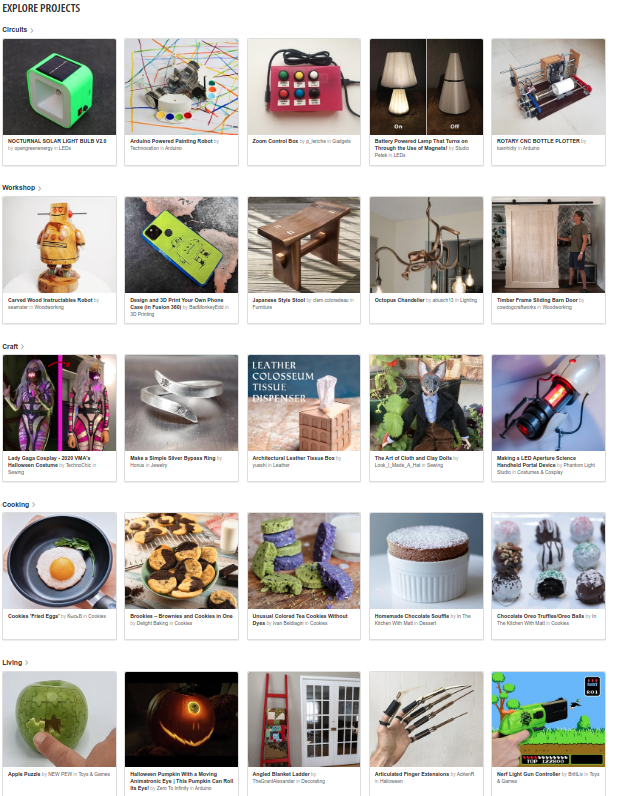
> *Listado de proyectos en la portada de Instructables.com*
> Captura de la portada de instructables.com
> [Licencia](https://www.instructables.com/community/Overview-of-License-on-Publish-page/)

Con solo entrar a su página vemos cómo el concepto de Open Hardware no solo se refiere a proyectos electrónicos, también se pueden desarrollar cualquier proyecto con esta licencia, tanto de diseño 3D, como de [*modificaciones* *para nuestro Toyota Prius*](https://www.instructables.com/How-to-Jump-Start-a-Toyota-Prius/)

Existen muchos proyectos de sistemas de riego, como [*éste*](https://www.instructables.com/Automatic-Irrigation-System-Arduino-With-Usb-Type-/), o control de toldos con seguridad NFC como [*este otro*](https://www.instructables.com/Smart-Balcony-Shade-Using-NFC/) o casi cualquier cosa que se nos ocurra, como puede ser este [cortacesped](https://twitter.com/FreeCADNews/status/1327201595944296448) diseñado con la herramienta [*Freecad*](https://www.freecadweb.org/) también Open source

> *Diseño opensource de cortacesped*
> [Freecad](https://forum.freecadweb.org/viewtopic.php?f=24&t=48473&p=447135#p447135) 

### Makezine

Otra comunidad que surgió online y que creció enormemente fue la que generó la página [Make](https://make.co/), donde se compartían todo tipo de proyectos abiertos, muy orientados al mundo maker.

Desde sus inicios, al mismo tiempo que se creaban todo tipo de publicaciones como la revista [MakeZine](https://makezine.com/) o [multitud de libros](https://www.makershed.com/collections/books-magazines), comenzó a crear una [red de  Maker Faires](https://makerfaire.com/map/), donde cualquiera podía presentar sus proyectos, colaborar en otros y generar una red entre entusiastas del mundo maker.

En España son unos referentes tanto a nivel de encuentros maker, como los grupos que han generado y que comparten todo tipo de proyectos, las [Maker Faire de Galicia](https://galicia.makerfaire.com/) y de [Maker Faire de Madrid](https://madrid.makerfaire.com/). Dos referentes de la difusión del conocimiento libre

De este nació una empresa que gestiona la venta de los libros, revistas y kits, pero el crecimiento desmesurado y las crisis económica han lastrado su crecimiento y a día de hoy pasa por dificultades, aunque se mantiene en funcionamiento

## Empresas con filosofía Open Hardware

El Open Hardware también ha permitido la creación de empresas exitosas, empresas que han nacido desde el convencimiento de compartir todos sus diseños con licencias Open Hardware.

Uno de los mejores ejemplos puede ser [**Adafruit**](https://www.adafruit.com/) creada y dirigida por [***Limor Fried***](https://es.wikipedia.org/wiki/Limor_Fried), gran maker, gran empresaria, impulsora desde ejemplo del movimiento Open Source y de la inclusión de la mujer en el mundo maker y de la ingeniería. 

> Limor Fried
> [Imagen de la wikipedia](https://en.wikipedia.org/wiki/Limor_Fried)
> Licencia CC BY SA 2.0

Adafruit nació en 2005 como un proyecto personal de Limor, que diseñaba y creaba proyectos electrónicos, los documentaba perfectamente, compartiendo todos los diseños y los detalles en cuidadosos tutoriales (siempre ha sido una marca de la casa la calidad de su documentación y guías). 

Podemos encontrar todos los diseños y la documentación de sus productos en su [página de github](https://github.com/adafruit) donde tienen más de 1400 repositorios. Como detalle curioso, podemos ver que [Limor Fried sigue contribuyendo a los repositorios de los proyectos con su nick LadyAda](https://github.com/ladyada) (claro homenaje a Ada Lovelace)

Al mismo tiempo empezó a vender kits con los componentes para soldar los proyectos. A día de hoy sus productos se venden en todo el mundo y la empresa la formaban más de 100 personas ya en 2016, año en facturó 45 millones de dólares.

Otra empresa con una enorme vocación Open Source, es [Sparkfun](https://www.sparkfun.com/) a partir de cuyos diseños se han creado muchas otras empresas especializadas en mejorar o abaratar sus diseños. La empresa nació en 2003 y en 2015 ya tenía más de 150 empleados. Todos los productos de Sparfun tienen licencia Open Source.

No podemos olvidarnos por supuesto de  [*Arduino*](https://www.arduino.cc/) que a día de hoy es una gran empresa, que vende sus productos en todo mundo y a la que debemos el éxito del movimiento Maker.

Arduino ha seguido generando multitud de placas, compartiendolas siempre con licencia Open Source, también ha permitido generar una enorme comunidad online que ha compartido sus proyectos.

Durante todos los años ha celebrado reuniones de usuarios locales conocidos como los ["Arduino Day"](https://day.arduino.cc/).

La empresa [m5Stack](https://m5stack.com) nació en 2015, con la idea de facilitar el trabajo a travé de la creación de prototipos y creó un conjunto de módulos de distinta funcionalidad y que se conectaban con facilidad. A día de hoy son un estándar y sus productos no paran de crecer beneficiado por la interacción con sus usuarios que tienen [todos los detalles para mejorarlos](https://m5stack.oss-cn-shenzhen.aliyuncs.com/resource/docs/schematic/Core/M5-Core-Schematic(20171206).pdf).

Aunque algunas empresas aprovechan la difusión de los diseños Open Hardware para producir copias baratas y ganar así cuota de mercado, muchas empresas optan por mejorar los diseños, y proporcionar a los usuarios una mejor experiencia, tanto en la documentación como en los productos. 

Es por ejemplo el caso de la empresa china [Elecfreaks](https://www.elecfreaks.com/) que desde sus inicio creó placas compatibles con Arduino pero que tenían multitud de mejoras como el mítico Freaduino y el formato de todos los sensores que los demás fabricantes fueron adoptando.

## El Open Hardware llega a los fabricantes de CPUs

En 2010, la universidad de Berkeley comenzó el diseño de un microprocesador totalmente abierto y libre. A este proyecto se unieron multitud de voluntarios y posteriormente de empresas como AMD, Google, HP, Huawei, IBM, Nvidia, la fundación Raspberry Pi, y muchas más.

Un procesador abierto permitiría que cualquier fabricante de electrónica lo usara en sus diseños y que todo el software desarrollado para él fuera compatible.

Pasados algunos años nació RISC-V: un procesador totalmente Open Hardware, con una arquitectura totalmente abierta, algo impensable hace unos años.

El que esté publicado todo su diseño permite que estudiantes de todo el mundo

Si quieres puedes leer más sobre RISC-V en [su página de la wikipedia](https://es.wikipedia.org/wiki/RISC-V) o en su [web oficial](https://riscv.org/) de donde podemos [descargar todas sus especificaciones](https://riscv.org/technical/specifications/).

## Licencias Open Hardware para empresas

Por aclarar conceptos ¿puede una empresa vender un producto que otra empresa licencia como Open Hardware? Todo esto va a depender de la licencia que use la empresa creadora.

Veamos 2 ejemplos:

* Adafruit vende una placa llamada [*Feather*](https://www.adafruit.com/product/2830), de la que > comparte el [*diseño*](https://learn.adafruit.com/assets/28509) con licencia [*CC BY-SA 3.0*](https://creativecommons.org/licenses/by-sa/3.0/es/) (pide > atribución y que se respete la licencia y se compartan las  modificaciones). Si quisiera compartirlo pero que nadie pudiera venderlo podría usar la licencia [*CC BY-NC 4.0*](https://creativecommons.org/licenses/by-nc/4.0/) que lo prohíbe específicamente.

* Arduino en la [*documentación de sus placas*](https://content.arduino.cc/assets/UNO-TH_Rev3e_sch.pdf) también usa la misma licencia, lo que ha permitido que muchas otras empresas fabriquen placas clónicas de las suyas. Pero incluye cláramente que no pueden llamarlas “Arduino”, puesto que esto es una marca comercial, por eso proliferan las placas llamadas ...duino (añada el prefijo que más les guste)

## Impresión 3D

A partir de estos desarrollos abiertos se han creado proyectos más complejos y tan exitosos como [**RepRap**](https://reprap.org/wiki/RepRap), proyecto abanderado por [*Adrian Bowyer*](https://es.wikipedia.org/wiki/Adrian_Bowyer), originariamente destinado a crear prototipos en los laboratorios de un modo más rápido y eficiente y que ha hecho accesible a todo el público las **impresoras 3D**, permitiendo que cualquier persona con unos mínimos conocimientos técnicos pueda montarlas y utilizarlas.

> *Primera replicación de una impresora 3D.*
> [Imagen de la wikipedia](https://es.wikipedia.org/wiki/Archivo:First_replication.jpg)
> Licencia CC BY SA 3.0

Adrian Bowyer creó una impresora que era capaz de imprimir ciertas piezas (de plástico) que no podía comprar, y que permitieron mejorar su diseño (que usabas piezas de madera talladas a mano). Imprimió unas piezas nuevas que regaló a su compañero de laboratorio junto con todos los detalles para reproducir su impresora y este puedo hacer una nueva impresora (la que aparece como “Child” en la foto)

De hecho, compartió sus diseños en internet permitiéndonos a todos acceder a esa tecnología.

Sus diseños se fueron difundiendo y perfeccionando, haciendo cada vez impresoras más precisas y duraderas. Como las mejoras se volvían a compartir, todos los usuarios podían volver a mejorar sus impresoras, puesto que podían imprimir las piezas con los nuevos diseños.

Al mismo tiempo se mejoraba tanto el firmware de las impresoras, como todo el software necesario para que estas imprimieran. Todo ello con licencia Open Source.

Este proceso de mejora y difusión de la información dio lugar a varias generaciones de impresoras. Muchas de las impresoras actuales derivan de la I3 que diseñó Josef Prusa, por eso se llama a esa versión Prusa i3.

El éxito de este modelo fue tal que el carismático [*Josef Prusa*](https://www.prusa3d.es/sobre-nosotros/#timeline) fundó una empresa  [*Prusa Research*](https://www.prusa3d.es/) en 2012, y había vendido más de 130000 impresoras en 2018. 

Hay que tener en cuenta que el compartir todos los diseños con licencia abierta ha permitido que multitud de empresas creen sus propios productos optimizándolos en tener mejores precios o distinta funcionalidad.

Hoy en día estas impresoras son un producto que puedes comprar y empezar a usar cuando llegues a casa. Como prueba, podéis ver en [su tweet](https://twitter.com/albertochicote/status/1352592690739892225) una imagen de una impresión 3D hecha por mismísimo Alberto Chicote (sí, el cocinero) a partir de [un diseño](https://www.myminifactory.com/object/3d-print-bust-of-nefertiti-at-the-egyptian-museum-berlin-2951) compartido en la página myminifactory que liberaron los artistas Nora Al-Badri y Jan Nikolai Nelles como parte de un proyecto llamado [Scan de World](https://www.myminifactory.com/category/scan-the-world) que pretende crear un catálogo de obras de arte en 3D.

En España, este movimiento tuvo su difusión de la mano de los [tutoriales de Juan González](http://www.iearobotics.com/wiki/index.php?title=Guia_de_montaje_de_la_Prusa_2) [*@obijuan*](http://www.iearobotics.com/wiki/index.php?title=Obijuan_Academy) que nos permitieron aprender sobre el uso de las impresoras y el software libre de diseño 3D como [*FreeCad*](https://www.freecadweb.org/). 

A partir de su iniciativa se crearon comunidades online, como [CloneWars](https://www.reprap.org/wiki/Proyecto_Clone_Wars) donde los participantes regalaban las piezas de plástico a quien quería montarse una impresora a cambio de que éste hiciera lo mismo cuando la tuviera lista, lo que dio lugar a un ["árbol genealógico"](https://www.reprap.org/wiki/Clone_Wars:_El_imperio_de_los_clones/es)

También nacieron multitud de comunidades locales, como la granadina "Granada Imprusa"

El mundo de la impresión 3D nos da un gran ejemplo de lo que podemos conseguir dentro del Open Hardware: diseños y proyectos que podemos descargar y reproducir con nuestra impresora 3D, como por ejemplo este [Microscopio impreso](https://www.thingiverse.com/thing:77450) (sólo necesita las lentes y la iluminación)

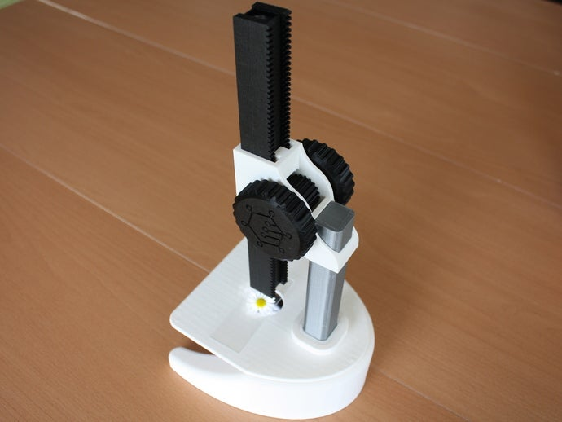
> Microscopio impreso
> [Imagen del modelo](https://www.thingiverse.com/thing:77450)
> Licencia: Attribution-NonCommercial 4.0 International (CC BY-NC 4.0)

En los diferentes repositorios de modelos 3D, como [*Thingiverse*](https://www.thingiverse.com/) o [*Cult3d*](https://cults3d.com/es) o [*Minifactory*](https://www.myminifactory.com/es/) nos vamos a encontrar diseños de todo tipo, con diferentes licencias, unos serán gratuitos y otros de pago.

## FPGAWars o cómo convertir una empresa al movimiento Open Hardware

Vamos a ver otro ejemplo de cómo el movimiento Open Hardware puede revolucionar un sector. 

Primero veamos un poco qué es una FPGA...

Desde hace muchos años (a mediados de los 80s) existen unos chips llamados [**FPGAs**](https://es.wikipedia.org/wiki/Field-programmable_gate_array), que nos permiten crear en su interior una gran variedad de circuitos. 

Podemos pensar que una FPGA es como un circuito en blanco, repleto de piezas desconectadas y que mediante cierto proceso, parecido a la programación, podemos convertir en un circuito concreto. Si detectamos un error podemos volver a repetir el proceso arreglando el error.

El proceso para “programar” las FPGAs era algo cerrado por los fabricantes, que obligaban a sus usuarios a comprar un software capaz de hacer ese proceso. Debido a esto su uso estaba restringido a grandes proyectos con abultados presupuestos.

En mayo de 2015, Claire Wolf y Mathias Lasser con su proyecto [*iceStorm*](http://www.clifford.at/icestorm/) crearon un conjunto de herramientas Open Source que permitían usar de una manera libre algunos modelos de FPGAs, permitiendo que cualquiera pueda usar ahora estas herramientas. Podéis leer más detalles de esta historia [*en la charla*](https://github.com/Obijuan/myslides/wiki/2016_09_23-Granada-Geek-FPGAs-Libres) de [*Juan González @Obijuan*](https://twitter.com/obijuan_cube?lang=es) que tuvimos el honor de recibir en la OSL en mayo de 2016.

A raíz de este desarrollo Juan González y el granadino [*Eladio Delgado*](https://twitter.com/eladiodm?lang=es) crearon unas placas Open Hardware que usaban FPGAs: la [*IceZum Alhambra*](https://github.com/fpgawars/icezum/wiki) y la [*Alhambra II*](https://github.com/FPGAwars/Alhambra-II-FPGA/wiki).

Al mismo tiempo crearon la comunidad virtual [**FPGAWars**](https://groups.google.com/g/fpga-wars-explorando-el-lado-libre) (sigue con la temática friki...) orientadas a la difusión de estas tecnologías desde una perspectiva totalmente libre. 

El esfuerzo de los participantes, y especialmente de Juan González, en la creación de [tutoriales](http://fpgawars.github.io/#tutorials) para que legos en la materia pudiéramos usar estas tecnologías.

Se desarrollaron también entornos de trabajo sencillos de usar como [*iceStudio*](https://icestudio.io/) y que nos permiten a todos usar esta tecnología que antes sólo estaba en manos de unos pocos.

Finalmente, las mismas empresas que antes obligaban a comprar su software, ahora colaboran en las herramientas libres.

Ahora mismo y siguiendo unos ["sencillos" pasos ](https://github.com/Obijuan/RISC-V-FPGA) perfectamente documentados, podemos ejecutar un sistema operativo Open Source como es Linux sobre una FPGA Open Hardware que implementa un procesador Open Hardware como es el RISC-V, del que hablamos anteriormente.

## Open Hardware en el laboratorio

Existe una red de laboratorios Open llamada [Hackeria](https://www.hackteria.org/) y que comparten actividades abiertas y una gran vocación de compartir el conocimiento Open Hardware en este caso más orientado a los equipos de laboratorio para trabajar todo lo relacionado con la biología de laboratorio.

Su objetivo es difundir no sólo la parte tecnológica de los proyectos, si no también todo lo relacionado con la realización de experimentos biológicos y la difusión de los conocimientos entre la ciudadanía, con el fin de aplicar la filosofía Hazlo Tú Mismo (DIY) al mundo de la biología.

Esta misma filosofía, la podemos encontrar con encuentros, como los [BioTecnoencuentros](https://www.guadatech.com/3er-biotecnoencuentro-pulpi-2019/) organizados por la asociación [Guadatech](https://www.guadatech.com/) en Almería, y donde se comparten y publican proyectos y conocimientos de biología mezclados con proyectos de robótica o programación. El público multidisciplinar de estos encuentros, junto a la naturaleza abierta de los conocimientos que se exponen dan lugar a proyectos que se han aplicado en institutos de la zona.

### Proyectos de DIY-BIO

Veamos algunos ejemplos de estos proyectos como pueden ser estos equipos de laboratorio bioquímico totalmente open-source. Podemos conseguir tanto el diseño de las piezas para imprimir la carcasa, como el diseño de la electrónica y los programas que las controlan.

Muchos de estos proyectos tratan de reciclar materiales y están tan simplificados y bien documentados que se pueden reproducir fácilmente por personas sin demasiados conocimientos.

También son proyectos que permiten a países en vías de desarrollo utilizar tecnologías que económicamente estarían fuera de su alcance.

    
> Equipo de laboratorio Open source
> [Imagen](http://hackteria.org/wiki/File:Urs_tools.jpg) de Hackeria
> Licencia: Creative Commons Attribution 3.0  

- Una centrifugadora de materiales biológicos basada en Arduino. Se trata de reciclar un disco duro estropeado para crear una centrifugadora que podremos usar en nuestros proyectos biológicos.

    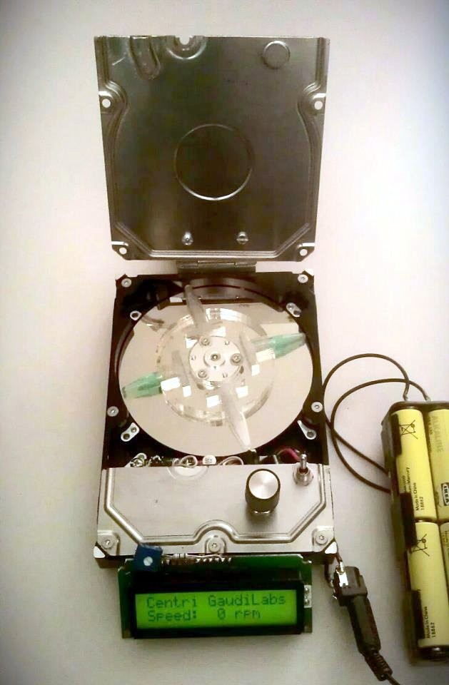
> Centrifugadora hecha a partir de un disco duro
> [Imagen](http://hackteria.org/wiki/Hacked_Hard-disc_Centrifuge)
> Licencia: Creative Commons Attribution 3.0  

* O una termocicladora (para hacer PCRs) totalmente Open Source. Muy de moda ahora, un PCR es una máquina capaz de amplificar una muestra de ADN para analizarla.
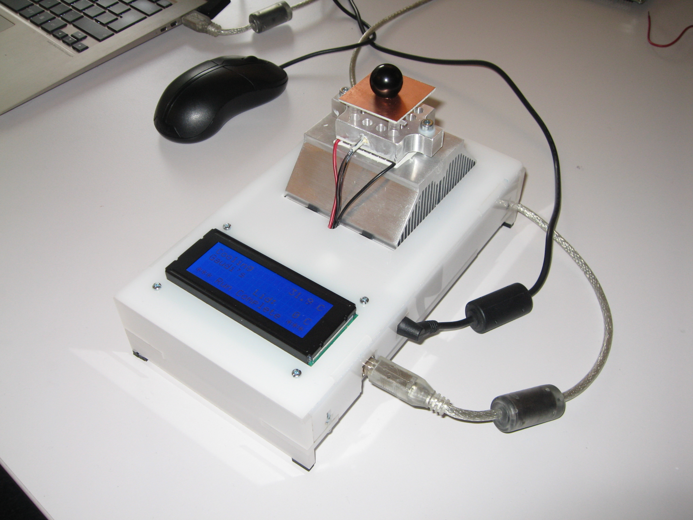
> Open Termocicladora o PCR
> [Imagen](http://hackteria.org/wiki/Wild_OpenPCR)
> Licencia: Creative Commons Attribution 3.0 

* O una incubadora biológica, que nos va a permitir acelerar el crecimiento de muestras biológicas.
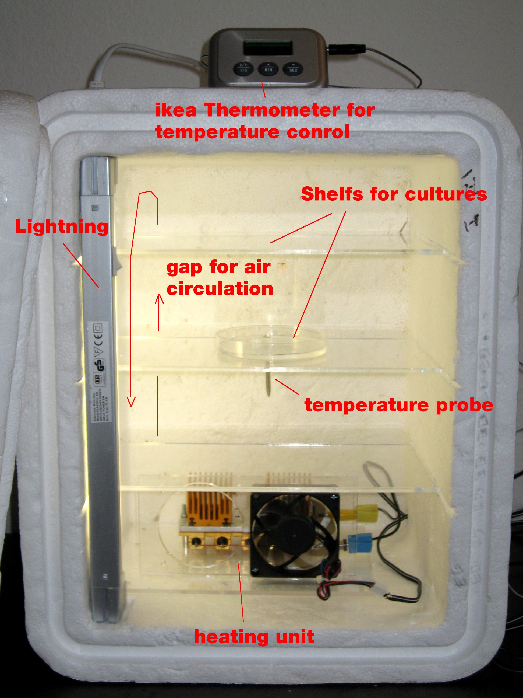
> Incubadora DIY
> [Imagen](http://hackteria.org/wiki/DIY_Incubator)
> Licencia: Creative Commons Attribution 3.0 

Equipo completo de Open Labs, casi un laboratorio profesional que podemos reproducir libremente.
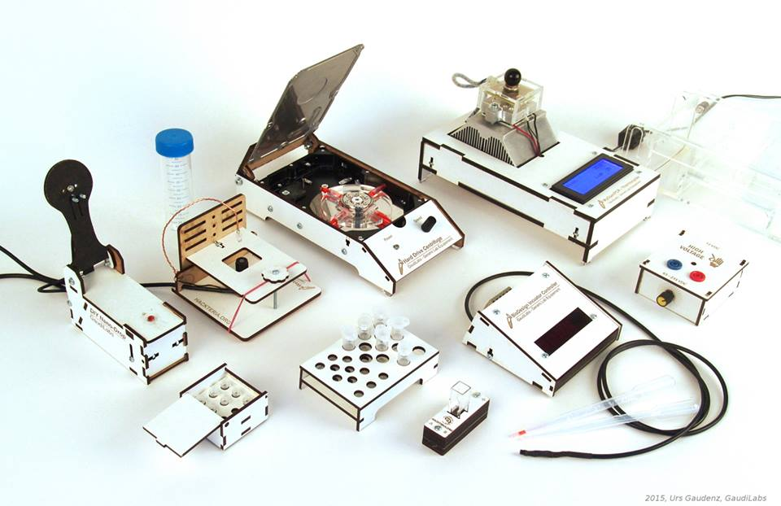
> *Material de Open Labs*
> [Imagen](http://hackteria.org/wiki/Generic_Lab_Equipment#Lab_tools)
> Licencia: Creative Commons Attribution 3.0 

Con estos materiales podríamos hacer (salvo por el tema de la seguridad biológica de las muestras) los tests PCRs que se hace en los hospitales

Y estos equipos no son cosa de "frikis", la mismísima revista Nature se ha hecho eco en varios artículos sobre el tema:

* [A DIY approach to automating your lab](https://www.nature.com/articles/d41586-019-01590-z)
* [How DIY technologies are democratizing science](https://www.nature.com/articles/d41586-020-03193-5)

Además el que dispongamos de toda la información sobre un producto le asegura una vida útil más larga, facilita la posibilidad de reparaciones y nos evita la dependencia con la empresa que nos lo vendió.

## Makers ante la pandemia

Durante la pandemia y ante la petición de ayuda de los sanitarios, equipos de makers de toda España se autoorganizaron para aportar todo tipo de equipamiento de protección, consiguiendo generar miles de caretas, salvaorejas, adaptadores para equipos de respiración ... 

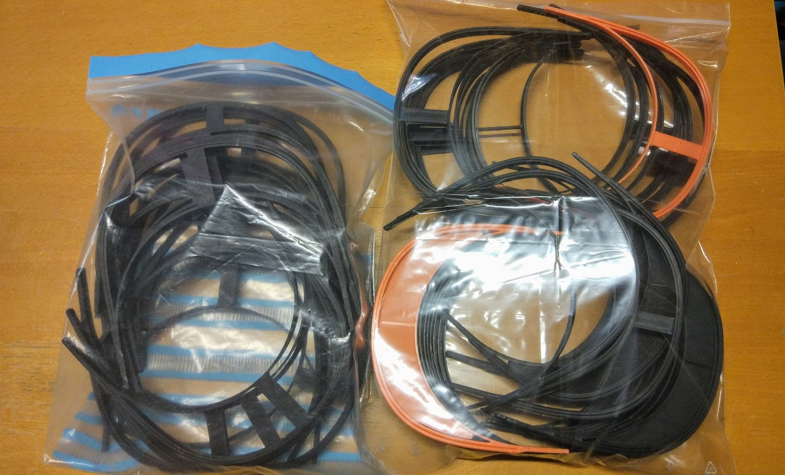
> Equipo de protección EPI
> Foto propia
> Licencia CC by SA

En la fase inicial de la pandemia, y ante la falta de respiradores, muchos grupos de makers se organizaron para diseñar equipos respiradores completamente abiertos y que se podrían fabricar libremente. El esfuerzo fue enorme y de esos días han quedado muchas organizaciones y asociaciones que siguen trabajando en proyectos libres. si te interesa puedes contactar con ellos a través de su [ReesistenciaTeam facebook](https://www.facebook.com/ReesistenciaTeam/) o de su [canal de Telegram Coronavirus Makers](https://t.me/coronavirus_makers)

La documentación de todos estos proyectos está compartida libremente y se sigue trabajando en ellos con el fin de que se puedan usar si es necesario o en lugares donde no se pueden comprar los equipos comerciales.

> *Ejemplo de la documentación del respirador*
> [Imagen de la documentación del respirador](https://gitlab.com/reesistencia)
> Licencia  GNU General Public License v3.0.  

## Resumen

Todo esto ha fomentado la difusión de las licencias libres haciendo conscientes a la población de las ventajas que aporta el trabajar en abierto y la publicación de manera libre y detallada de nuestros proyectos

Estas herramientas que están al alcance de la mayoría de la población, cada vez más sencillas de usar y fáciles de encontrar, ha permitido que casi cualquiera pueda crear todo tipo de proyectos, más o menos complejos.

Por ejemplo estas herramientas de prototipado rápido nos permiten crear equipamiento para laboratorio, máquinas que tienen el 90% de la funcionalidad de los equipos y con un coste de menos del 10%.

Además, **la naturaleza colaborativa y abierta de estos proyectos, nos anima a tomar un papel más activo en ellos**, permitiéndonos a los usuarios de manera natural participar en el desarrollo de estos equipos, mejorando iterativamente sus prestaciones, aportando mejoras a la funcionalidad, documentación o ejemplos de uso.

En definitiva, todo este ecosistema abierto de conocimientos nos hace día a día tener más control sobre la tecnología que usamos, **permitiéndonos pasar de meros consumidores a dueños de esta tecnología**

Además al ser dueños de toda esta información podemos modificar nuestros proyectos, repararlos, mejorar sus prestaciones, traducir la información a otros idiomas,... en definitiva, tenemos control total sobre ellos.
