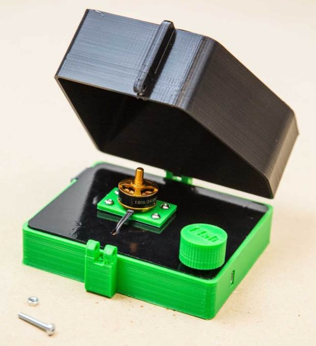

# Open Hardware

## Charla sobre Open Hardware para el curso de Software Libre de la UGR

## Licencia CC by SA 

## by José Antonio Vacas @javacasm

## Empecemos con un ejemplo...

Un ejemplo para entender qué es esto del Open Hardware:

* En ¿2009? Arduino crea una primera versión ... TODO

* El usuario **Joo** (Johannes) publica todos los detalles de su [proyecto plotClock](http://wiki.fablab-nuernberg.de/w/Ding:Plotclock) dando detalles para construirlo, diseños 3D y código fuente para que cualquiera pueda reproducirlo con licencia CC, utilia la placa y el código de Arduino

    

* Por otro lado la empresa Expressif crea un dispositivo [ESP32](https://www.espressif.com/en/products/modules/esp32) y libera toda la documentación, los detalles y los diseños necesarios para que cualquiera pueda usarlos.

    

* A partir de esos diseños la empresa [M5Stack]() crea el [m5Stick](https://m5stack.com/collections/m5-core/products/m5stickc-plus-esp32-pico-mini-iot-development-kit?variant=35275856609444) un sistema integrado compatible con Arduino y de un tamaño superreducido

* Luis Llamas, un conocido maker,  crea ESP32_faces, un software que permite mostrar "caritas" y "ojitos" en un M5Stack publicando con licencia  todo su 

    

* Nochi (@shikarunochi), un maker japonés, uniendo todos estos recursos ha montado esta monada de robot escribiente (aunque parece que tiene mejorar su letra...)

    

El desarrollo del **Open Hardware** ha permitido la aparición de productos como **Arduino** o **micro:bit**  cuyo diseño y  documentación han sido publicadas completamente bajo licencias **Libres**

TODO: Enlaces a los tweets y publicaciones

A partir de estos desarrollos se han creado proyectos tan exitosos como **RepRap** que han hecho accesible al público herramientas como las **impresoras 3D**, permitiendo que cualquier persona con unos mínimos conocimientos técnica pueda montarlas y utilizarlas

TODO: Historia del movimiento REPREAP

En España su difusión vino de la mano de los tutoriales de @obijuan 

TODO: desarrollar

Ejemplos de impresión 3D:

[Microscopio impreso](https://www.thingiverse.com/thing:77450) (sólo necesita las lentes y la iluminación)

TODO:

Alrededor de estos proyectos se han creado enormes comunidades que han facilitado el aprendizaje y por tanto la creación de prototipos, donde se comparten toda la documentación de proyectos, como por ejemplo [Hackster.io](https://Hackster.io) que lleva Alex Glow (@glowascii)  

También se ha creado una importante economía, con grandes empresas como **Adafruit** creada y dirigida por Limor Fries (@adafruit), gran maker, gran empresaria, "adalid" del movimiento OpenSource y de la inclusión de la mujer en el mundo maker y de la ingeniería

o Sparkfun TODO:

Todo esto ha fomentado la difusión de las licencias libres haciendo conscientes a la gran mayoría de sus usuarios de las ventajas que aporta el trabajar en abierto y la publicación de manera libre y detallada nuestros proyectos

Con estos elementos al alcance de la mayoría se popularizado y simplificado tanto las herramientas de prototipado que practicamente cualquiera puede trabajar y crear todo tipo de proyectos.

En particular estas plataformas de prototipado rápido nos permiten crear equipamiento para laboratorio, máquinas que tienen el 90% de la funcionalidad de los equipos y con un coste de menos del 10%.

Además, **la naturaleza colaborativa y abierta de estos proyectos, nos amina a tomar un papel más activo en ellos**, permitiendonos a los usuarios de manera natural  participar en el desarrollo de estos equipos, mejorando iterativamente sus prestaciones, aportando mejoras a la funcionalidad, documentación o ejemplos de uso.

En definitiva, todo este ecosistema abierto de conocimientos nos hace día a día tener más control sobre la tecnología que usamos, **permitiendos pasar de meros consumidores a dueños de esta tecnología**

Algunos ejmplos de estos proyectos pueden ser estos equipos de laboratorio bioquímito totalmente open-source 

* Una centrifugadora de materiales biológicos basada en Arduino
    

* O una termocicladora (para hacer PCRs) totalmente open 
    

* O una incubadora biológica

Con estos materiales podríamos hacer (salgo por el tema de la seguridad biológica de las muestras) los tests PCRs que se hace en los hospitales

## Recursos

[Curso de Software Libre](https://abierta.ugr.es/software_libre/)

[Vídeos](https://osl.ugr.es/videos/)

enlaces TODO: 

reprap
tutoriales obijuan
historia adafruit
...